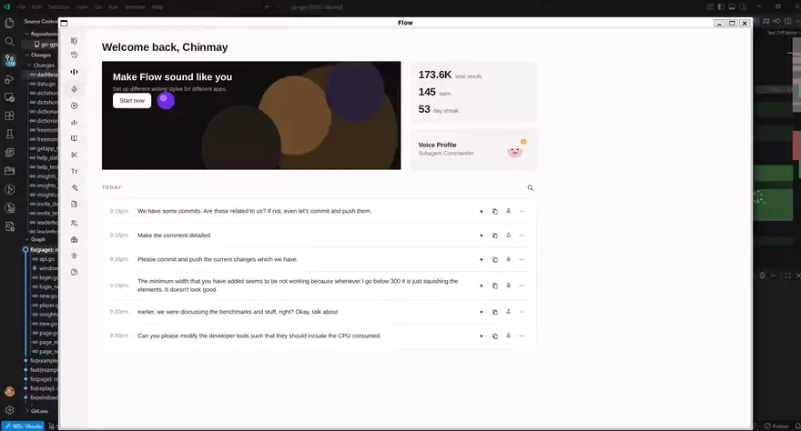
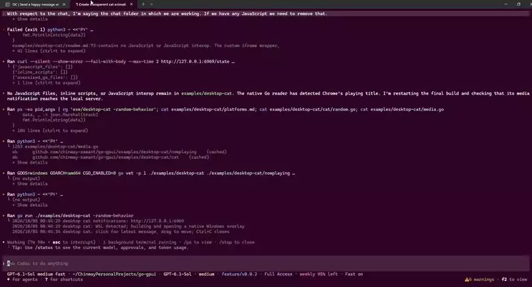

# go-gpui

**Write the screen in HTML. Write the logic in Go. Ship one binary to the desktop, the browser, and the phone.**

No Chromium, no WebKit, no wrapper around either. The HTML and CSS work is done by [gowkhtmltopdf](https://github.com/chinmay-sawant/gowkhtmltopdf), a layout engine written from scratch in Go.

You pass a template to `New`, store its data with `SetData`, and register handlers for clicks and keys. A click on `data-action` calls your Go function. `examples/login` is the sign-in program.

```go
page, err := gpui.New(gpui.Config{
    Title:  "Hello",
    HTML:   `<h1>{{.Title}}</h1>`,
    Width:  480,
    Height: 640,
})
page.SetData(struct{ Title string }{"Hello"})
gpui.Run(context.Background(), page)
```

## Demo

go-gpui preview. HTML and CSS layout with a layout engine written in Go, no Chromium or WebKit.

[](https://x.com/chinmay_sawant_/status/2106788230154871126)

[Watch the full preview on X](https://x.com/chinmay_sawant_/status/2106788230154871126)

Desktop cat overlay. Transparent, click-through cat that reports what is happening inside opencode.

[](https://x.com/chinmay_sawant_/status/2106829998409789929)

## Why this exists

Writing a desktop UI in Go leaves three roads. Electron gives you the whole web platform and ships Chromium and Node with every app, so the installer runs past a hundred megabytes, every message crosses a process bridge, and you track Chromium security releases on someone else's schedule. A Rust GPUI builds the UI in code, in a systems language, behind a render trait and its own layout engine. This library takes the third road: keep HTML and CSS as the UI layer, keep Go for the logic, and ship neither a browser engine nor a JavaScript runtime.

That road needs a layout engine, and the engine is [gowkhtmltopdf](https://github.com/chinmay-sawant/gowkhtmltopdf), a separate project where the HTML parser, the CSS cascade, and the layout pass are written in Go. Blink is how Electron gets a full engine, by shipping all of Chromium. This one lays documents out in Go instead, and hands the placement back as a list of operations. It is not a Blink replacement in features. Of the 818 CSS properties in the webref catalog, 407 are implemented and none is half-finished, audited on 2026-09-21 ([theming.md](documentation/theming.md)). No video, canvas, or WebGL, which is why those are absent here too.

`Redraw` fills your `html/template`, then gowkhtmltopdf parses it, applies the CSS, and lays it out. The window replays that placement as vector operations on the Ebiten canvas, or blits the painted image when an operation has no replay. One process, one binary, no V8, no preload script, no `node_modules`. The same page definition runs on the desktop, as WebAssembly in a browser, and through an Android or iOS bind.

The price is worth stating plainly. The screen is a laid-out picture rather than a live DOM, so there is no JavaScript and no video, canvas, or WebGL. The DevTools inspector is window chrome, not a DOM view: F12 or Ctrl+Shift+I opens a right dock with the element JSON, frame counters, and operation list, and `GET /debug/state` serves the same data in web mode ([devtools.md](documentation/devtools.md)). That list is in [features.md](documentation/features.md), and [compare-electron.md](documentation/compare-electron.md) plus [compare-rust-gpui.md](documentation/compare-rust-gpui.md) put this library next to both alternatives.

The comparison those two files leave out is the nearest one, a Go widget toolkit such as gogpu/ui. It builds the screen as a tree of Go values, every style a chained method call, and renders that screen through its own GPU stack. That design catches a wrong call at build time, and this library trades that check for CSS. A selector that matches nothing compiles and draws nothing, and the window is the only test. What the trade buys is CSS itself: more expressive than any builder API, already known to nearly every developer, editable by someone who does not write Go, and hot-reloadable in the open window. Neither design removes the difficulty of layout. This one moves it out of every app and into a single engine, and that trade is why this library exists.

MyGo takes two of those roads in the same app. It serves a web page in the webview the OS already has, WKWebView, WebKitGTK, or WebView2, with a TypeScript client generated from the Go services it calls, and it also carries a Go widget toolkit for windows that should not pay for a webview. The webview adds nothing to the download because the OS ships it, and each platform's own engine and quirks come along. This library keeps one UI language in every window and ships no webview and no JavaScript: the same HTML and CSS render in its own engine on the desktop, in the browser, and on a phone.

## Running the examples

`go run ./examples/<name>` opens a window. `go run ./examples/<name> -web` serves the same screen over HTTP instead. [examples/readme.md](examples/readme.md) lists every example with one line each. The sign-in demo accepts `secret` and `secret`.

```
go run ./examples/login              # desktop window
go run ./examples/login -web         # picture page on 127.0.0.1:8091, -addr changes it
sh scripts/browser.sh                # the same window as WebAssembly on 127.0.0.1:8092
```

Drag an edge to resize; the login window's smallest size is 320 by 400 and the screen is laid out again at the new size. Click a field to place the caret, and drag to select a span. Ctrl-C, Ctrl-V, Ctrl-X, Ctrl-A, Ctrl-Z, and Ctrl-Y work on the focused field, Enter submits, and the wheel scrolls a page larger than the window.

For a phone, with the Android SDK or Xcode installed:

```
go install github.com/hajimehoshi/ebiten/v2/cmd/ebitenmobile@v2.10.4
ebitenmobile bind -target android -javapkg com.chinmaysawant.gogpui -o go-gpui.aar ./examples/login/mobile
ebitenmobile bind -target ios -o go-gpui.xcframework ./examples/login/mobile
```

`examples/telegram` is the phone-first demo, and
`examples/telegram/android` is a ready Android project:
`sh scripts/android.sh install` binds it, builds a debug APK with Gradle, and
installs it over `adb`. The chat keeps its header and composer pinned while
the messages scroll. The one-time SDK setup, the device steps, and the
soft-keyboard note are in
[examples/telegram/android/README.md](examples/telegram/android/README.md).
Screenshots from a Pixel 7 are in [showcase.md](showcase.md).

`sh scripts/package.sh <example>` builds one example for this system and
writes a release archive to `dist/`, with `SHA256SUMS` beside it. `-n` prints
the layout and builds nothing. The per-system layouts, the caveats for
unsigned archives, and the wasm bundle are in
[packaging.md](documentation/packaging.md).

`go run ./examples/desktop-cat` opens the transparent overlay: a borderless
cat in the bottom-right corner, click-through outside its visible pixels,
with an HTML/CSS speech bubble and a notification API on `127.0.0.1:6969`
that an agent can post to. [examples/desktop-cat/readme.md](examples/desktop-cat/readme.md)
has the flags, the `catnotify` skill, and the Windows-only Chrome media
monitor.

## Where to read next

Each topic has one file. Nothing here repeats what those files already say.

| Topic | Read |
|-------|------|
| Every feature, grouped, and the list of what is absent | [features.md](documentation/features.md) |
| A dated scan with file citations | [features-examples.md](documentation/features-examples.md) |
| Config, sizing, DPI, audio, window limits | [window.md](documentation/window.md) |
| Desktop, WebAssembly, phone, and the capability matrix | [platforms.md](documentation/platforms.md) |
| Web mode routes and the PNG endpoint | [web.md](documentation/web.md) |
| Template to image, and `Page.PNG` | [screen.md](documentation/screen.md) |
| Display-list replay and the bitmap fallback | [screen.md](documentation/screen.md#replay) |
| Repaint only the box a click changed | [repaint.md](documentation/repaint.md) |
| Inspect boxes, operations, and frame counters | [devtools.md](documentation/devtools.md) |
| Edit a file and watch the open window redraw | [hot-reload.md](documentation/hot-reload.md) |
| Per-frame work with `Page.SetTick` | [frames.md](documentation/frames.md) |
| Keys and text chords | [keys.md](documentation/keys.md) |
| Clicks, hover, taps, and hit-test boxes | [pointer.md](documentation/pointer.md) |
| Focus, caret, selection, and the context menu | [interaction.md](documentation/interaction.md) |
| Wheel scrolling and scrollbar thumbs | [scrolling.md](documentation/scrolling.md) |
| `Config.Theme` and `SetTheme` | [theming.md](documentation/theming.md) |
| In-process `Send`, `Listen`, `Handle`, `Request` | [ipc.md](documentation/ipc.md) |
| `Load`, `Back`, `Forward`, `data-action` routes | [navigation.md](documentation/navigation.md) |
| `Fetch` and `XHR` over `net/http` | [fetch.md](documentation/fetch.md) |
| Copy and paste, including the Wayland fallback | [clipboard.md](documentation/clipboard.md) |
| Export a page as PDF, or print it | [printing.md](documentation/printing.md) |
| Show a file dropped on the window | [drag-drop.md](documentation/drag-drop.md) |
| Build a release archive for the desktop or the browser | [packaging.md](documentation/packaging.md) |
| Typing, undo, redo, select all | [editing.md](documentation/editing.md) |
| `input`, `textarea`, and `select` values | [forms.md](documentation/forms.md) |
| `data-bind` to struct fields | [binding.md](documentation/binding.md) |
| Panic reports on disk | [crash.md](documentation/crash.md) |
| Every example | [examples/readme.md](examples/readme.md) |
| Screenshots of the Telegram demo on a phone | [showcase.md](showcase.md) |
| Against Electron, and against the Rust framework | [compare-electron.md](documentation/compare-electron.md), [compare-rust-gpui.md](documentation/compare-rust-gpui.md) |
| The hello world in go-gui, gogpu/ui, and MyGo, side by side | [compare-syntax.md](documentation/compare-syntax.md) |

## What is not here

- No Chromium, V8, Node, preload script, or cross-process IPC. One Go process, one template.
- One window. No tray, native menus, OS notifications, or second window.
- No accessibility tree, desktop IME, spellcheck, or OS-global shortcuts. Android and iOS show the soft keyboard.
- No auto-update, installer, or uploaded crash dump.
- `Fetch` and `XHR` are one http or https request, with no cookies, cache, or session.

## Layout

```
internal/page/       the template, the picture, the display list, the input handlers
internal/render/     html.Parse, css.Apply, layout.Lay, or the display list
internal/replay/     paints the display list on the Ebiten canvas
internal/frame/      finds fill and text operations for a SetTick callback
internal/window/     the native window, and the same loop on a phone or in a browser build
internal/web/        the picture page on 127.0.0.1
internal/ipc/        in-process Send, Listen, Handle, Request
internal/fetch/      one http or https request
internal/clipboard/  the OS clipboard, with an in-memory copy
internal/crash/      a local panic report
internal/filepick/   the desktop open dialog
internal/print/      the OS print path for a PDF
examples/login/      the sign-in program
examples/telegram/   the phone-first chat demo and its Android project
browser/index.html   the page that loads the WebAssembly build
scripts/browser.sh   builds that page and serves it
scripts/android.sh   binds and builds the Android APK
scripts/package.sh   builds a release archive for this system
```

## Development

`make build` compiles every package and links nothing. `make test` runs `go test -p 1 ./... ./examples/...`. Leave `go build ./...` alone; it links an executable per example and leaves the binaries here.

`go.mod` pins [gowkhtmltopdf](https://github.com/chinmay-sawant/gowkhtmltopdf) to the `chore/changes-for-go-gpui` commit `1a3918301a68`, which carries `layout.DisplayList`, `Display.Boxes`, and `css.Relayout`. Text replay needs Ebiten v2.10.4 or newer.
