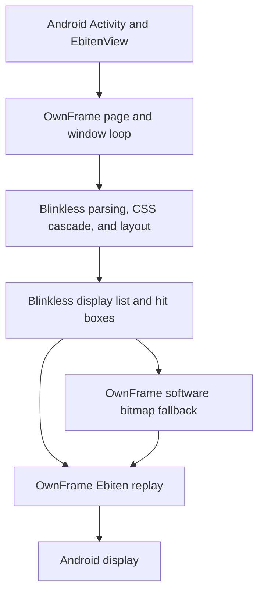

# Android runtime

OwnFrame runs HTML templates through Blinkless and Ebitengine inside an Android
`EbitenView`. The Activity uses the generated Go binding from `ebitenmobile`.
OwnFrame has no JavaScript engine or browser process.

Blinkless owns HTML parsing, CSS interpretation, geometry, paint order, and
operation payloads. OwnFrame owns template data, actions, forms, focus, selection,
history, scrolling, and screen updates. CSS layout is never reproduced in the
Android Activity or replay backend. Flexbox, Grid, absolute positioning, overflow,
gradients, and other CSS features arrive as geometry or encoded images.

## Coordinates and repainting

The engine pin is `v0.0.0-20261010174808-34d93862f9ed`, the pseudo-version for
commit `34d93862f9ed2eec613b0cdea11d3d6da089b574`. Both Go modules require it.
The commit corrects two previously swapped display factors. `PointsPerPixel`
is 0.75 points per CSS pixel. `PixelPerPoint` is 4/3 CSS pixels per point.
Hit boxes use CSS pixels, and operation coordinates use points.

`EbitenView` converts Android pixels to dp before reporting view size and input
to Go. OwnFrame uses those logical dimensions as CSS pixels. The native view
maps the game image back to the device scale. Applying Android density again in
OwnFrame would resize both paint and input incorrectly.

`Layout` records surface size changes. The next update relayouts the page, with
at most one layout per 100 ms during continuous resizing and a final layout
when the size settles. Cached HTML and styles skip parsing and stylesheet
collection while the executed template and theme stay the same. Blinkless still
resolves styles and layout during a requested redraw. Idle frames reuse the
display list. `WithPerf(true)` exposes timings and allocation counters.

Replay follows `Display.Order`. Dirty repainting uses persistent content or
viewport buffers. Fixed operations are culled against the viewport. A cached
scroll buffer is used only when engine paint order puts all viewport layers
above its content. Other orders use direct replay. Image eviction disposes the
GPU resource. Font sources and face variants have bounded caches.

## Input and Android lifecycle

A touch press updates `:active` immediately. A tap delivers one press and one
click. Movement past the slop starts scrolling, with horizontal and vertical
motion and existing flick deceleration. A second finger cancels the active press
before pinch zoom. Long press can claim text selection instead of scrolling.

`TouchCancellation` observes the native view. Ebitengine v2.10.4 ignores Android
`ACTION_CANCEL`, so the adapter releases every native pointer and calls the
bound `Mobile.cancelTouches`. `Page.CancelTouches` queues that request from the
UI thread. The window drops the hold, drag capture, and scroll velocity, then
suppresses touch input until native IDs clear. Each Android example also cancels
on pause before `suspendGame`; resume calls `resumeGame`.

Mobile IME sessions report the focused field and surrounding text. OwnFrame
converts the field rectangle through zoom and pending resize before handing it
to Ebiten. `Page.IMEContext` already removes the page scroll offset. Late
composition callbacks from an old focus cannot edit the new field. The old
field retains its displayed preedit as draft text when focus changes.

The shared `AndroidHost` handles system bars, cutouts, display configuration,
legacy Back, and predictive Back. Login, Platform, Dino, and LG Remote reserve
safe areas with host padding. Telegram applies vertical insets in its Go layout
and reserves lateral cutouts in its enclosing FrameLayout. Keyboard Back queues
blur on the game loop before hiding the keyboard. The IME bottom inset keeps the
Telegram composer above the keyboard.

Activity orientation changes reuse the running Go state through the existing
`configChanges` policy. Normal pause and resume retain the in-process page.
Activity reconstruction, multiple native views, and recovery after Android kills
the process have no persistent page-state contract. Applications must store
state they need across process death.

## Bitmap fallback and limits

Replay rejects operations it cannot draw accurately. The software fallback now
paints elliptical corners, borders, line segments, collapsed table grids,
opacity, affine geometry and images, rotated text, and CSS blend groups. Group
ownership determines compositing even when group markers follow paint entries
in `Display.Order`. A cached bitmap viewport keeps fixed operations stationary
when scrolling at the committed layout size. Scroll and zoom repaint that
viewport without another HTML parse. Idle frames reuse its GPU image.

Bitmap painting allows at most 16,777,216 pixels across the canvas and active
blend buffers and at most seven nested groups. Unknown operation kinds, missing
payloads, unsupported text shaping options, and excessive buffers return a
rendering error. The fallback does not claim full browser typography. It uses
OpenType font drawing and does not support `FontFeatures` or `TextAutospaceGap`.
These options currently fail bitmap painting instead of disappearing. The
fallback also costs more CPU during scrolling than display-list replay.

Fixed fallback projection applies at the committed viewport size. A pending
resize or a locked fitted view scales the complete fallback picture. The
application-specific `SetViewportPinZ` counter-scroll policy requires the replay
path. Desktop IME, an accessibility tree, and durable browser storage remain
outside this runtime.

The [validation record](../plans/v0.0.2/android-runtime-validation.md) lists
actual checks and profiling results. The [Android build guide](android-build.md)
has commands, and the [Telegram setup guide](../examples/telegram/android/README.md)
has SDK and NDK installation steps.
