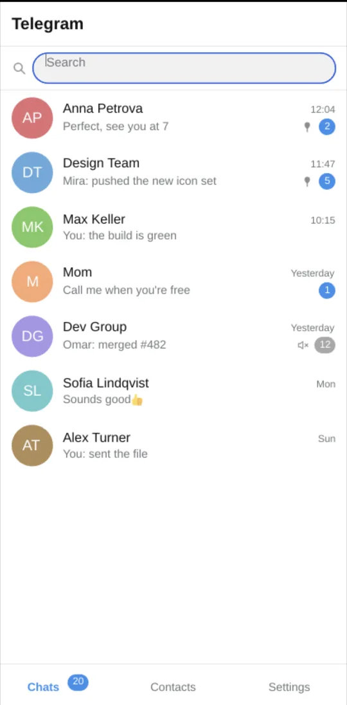
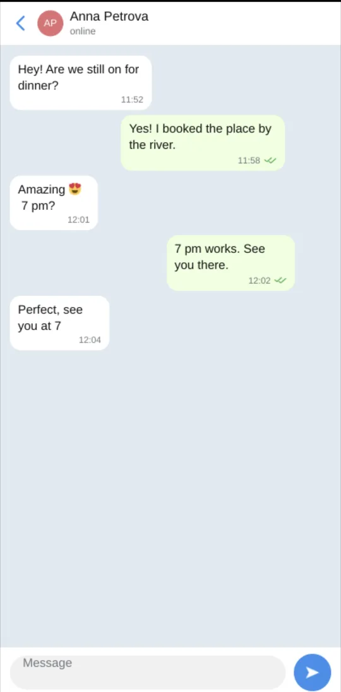
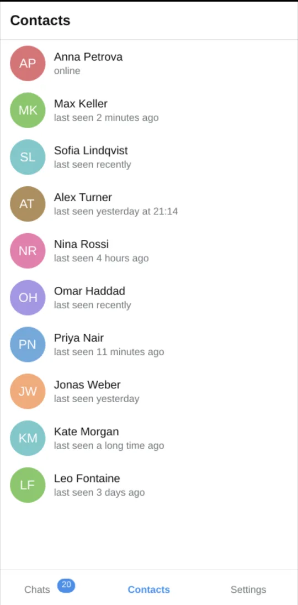
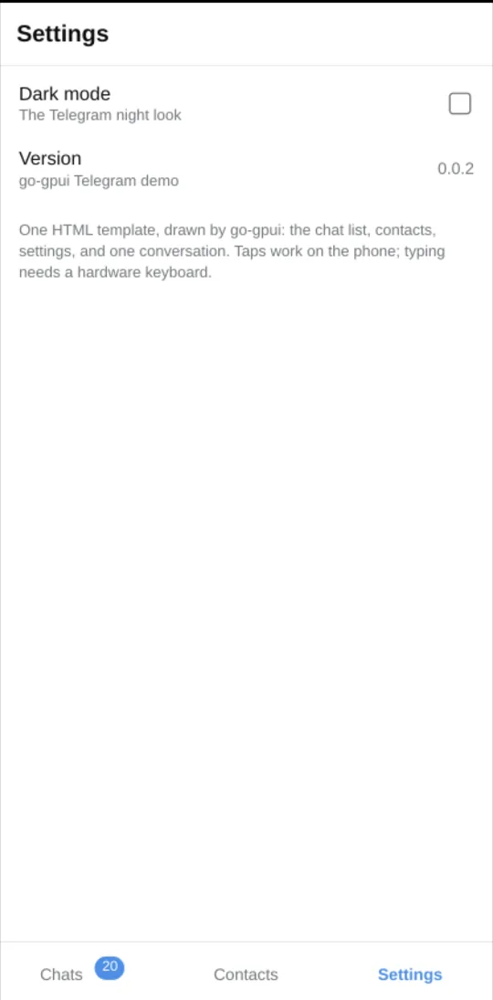
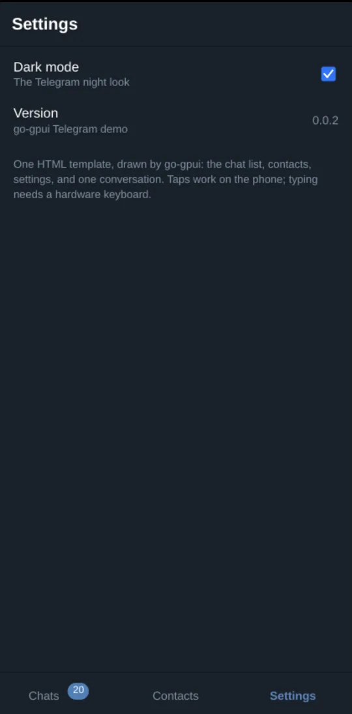
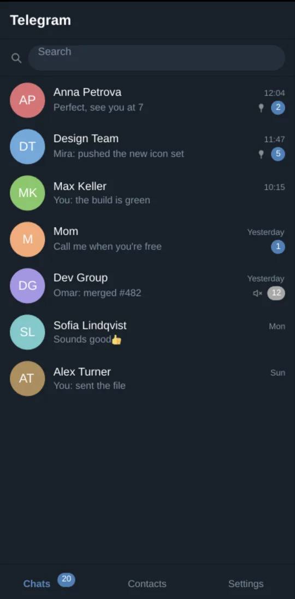
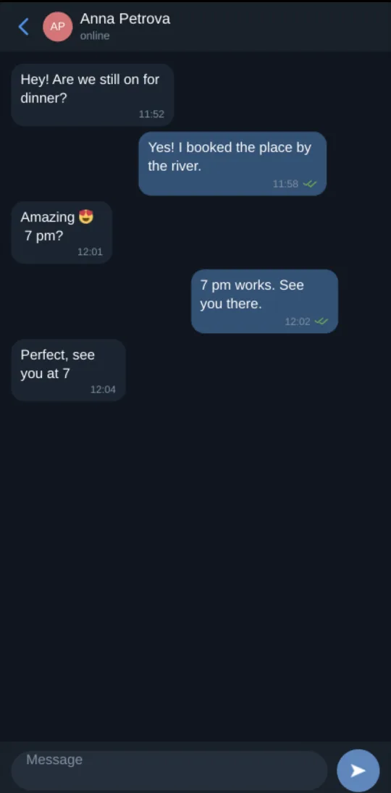

# Showcase

Screenshots of the examples, captured on real hardware.

## Telegram demo on a Pixel 7

`examples/telegram` is the phone-first example. The screens below are the
same HTML template that `go run ./examples/telegram` opens on the desktop,
bound to Android with `ebitenmobile`. `sh scripts/android.sh install` binds
it, builds a debug APK with Gradle, and installs it over `adb`; the one-time
setup is in [examples/telegram/android/README.md](examples/telegram/android/README.md).

| Chats | Conversation | Contacts |
|-------|--------------|----------|
|  |  |  |

| Settings | Settings, dark | Chats, dark | Conversation, dark |
|----------|----------------|-------------|--------------------|
|  |  |  |  |

Taps, tabs, opening a chat, drag-to-scroll, and the soft keyboard work on
the phone, and the system back gesture returns from a chat. The top bar
and composer stay pinned while the messages scroll, drawn above the
messages so a scrolled thread never covers them. The arm64 debug APK is
29 MB; binding all four ABIs puts one APK at 188 MB.
